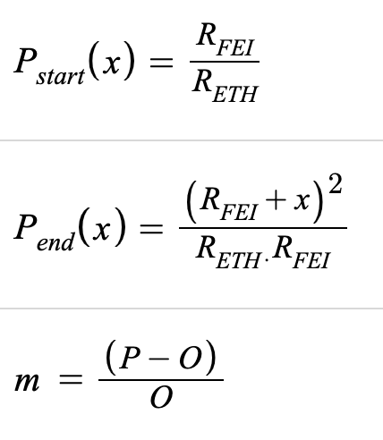

# UniRef

## Contract

[UniRef.sol](https://github.com/fei-protocol/fei-protocol-core/blob/master/contracts/refs/UniRef.sol) implements [IUniRef](https://github.com/fei-protocol/fei-protocol-core/blob/master/contracts/refs/IUniRef.sol), [OracleRef](https://github.com/fei-protocol/fei-protocol-core/blob/master/contracts/refs/OracleRef.sol)

## Description

UniRef is an abstract contract which references a Uniswap pool. It defines basic utilities for contracts referencing Uniswap. It leverages the [OracleRef](oracleref.md) contract to calculate various quantities relating to spot vs peg price. Let _R_  be the reserves of the referenced Uniswap pair, FEI/ETH for example. The UniRef calculates the price at the start and end of a hypothetical trade of size _x_ via the below formulas. It can then calculate the magnitude of the distance from the peg _m_ given an oracle price _O:_ 



It has other utilities relating to the peg _O_:

* Check whether below peg or not
* Get amount of a certain asset \(fei or other\) to trade to bring back to peg. This can be done by setting the end price in the above formula to _O_ and solving for _x_, replacing the FEI reserves with the target asset reserves and ETH reserves with the other asset reserves. We take the absolute value here and infer the direction based on whether above or below peg.



When calculating the magnitude distance from the peg, the protocol only needs to know the deviation when underpegged. Therefore at or above the peg UniRef returns 0 for the deviation. 


## Events



Referenced Uniswap pair contract update

| type | param | description |
| :--- | :--- | :--- |
| address indexed | \_pair | new Uniswap pair contract |



## Read-Only Functions

### router

```javascript
function router() external view returns (IUniswapV2Router02);
```

Returns the address of the UniswapV2Router as an interface.



### pair

```javascript
function pair() external view returns (IUniswapV2Pair);
```

Returns the referenced UniswapV2Pair contract as an interface.



### token

```javascript
function token() external view returns (address);
```

Returns the address of the ERC-20 token held in the UniswapV2Pair that is not FEI.

### getReserves

```javascript
function getReserves()
    external
    view
    returns (uint256 feiReserves, uint256 tokenReserves);
```

Returns the reserves of the referenced UniswapV2Pair contract, ordered as FEI, and the other token.


The feiReserves returned takes the max of the actual pair reserves and the pair token balance for FEI. This mitigates attacks which attempt to circumvent incentives by interacting directly with the Uniswap pair contract in non-standard ways.


### liquidityOwned

```javascript
function liquidityOwned() external view returns (uint256);
```

Returns the amount of UniswapV2Pair liquidity provider tokens owned by this contract.

## State-Changing Functions <a id="state-changing-functions"></a>

### Governor-Only⚖️

#### setPair

```javascript
function setPair(address _pair) external;
```

Sets the referenced Uniswap pair contract to `_pair`

emits `PairUpdate`

